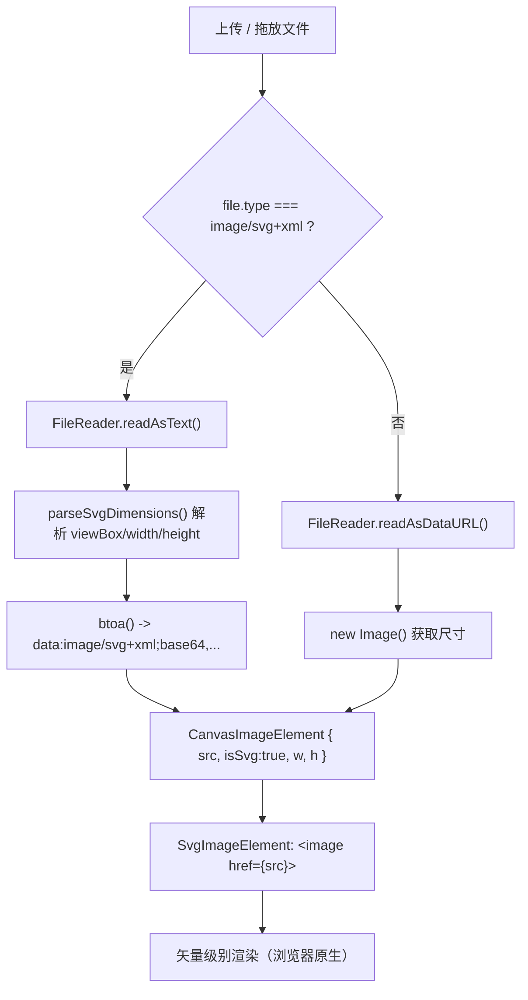

# SVG 矢量图形支持

## 现状分析

**当前已支持的图片格式：**所有 `image/*` MIME 类型（PNG、JPG、WebP、GIF 等），通过 `accept="image/*"` 和 `f.type.startsWith("image/")` 过滤。

**上传入口有三处：**
- [`AssetSection.tsx`](apps/web/modules/design/components/sidebar/sections/left/AssetSection.tsx) — 左侧面板素材区（全局画布图片）
- [`DesignCanvas.tsx`](apps/web/modules/design/components/canvas/DesignCanvas.tsx) — 画布整体拖放区
- [`KeycapEditorModal.tsx`](apps/web/modules/design/components/canvas/KeycapEditorModal.tsx) — 单键帽编辑弹窗内拖放区

**核心渲染：** [`SvgImageElement.tsx`](apps/web/modules/design/components/canvas/SvgImageElement.tsx) 使用 SVG `<image href={img.src}>` 渲染，SVG 数据 URL 在现代浏览器中会以矢量方式渲染（不会光栅化）。

**当前 SVG 的问题：**
1. 尺寸获取失败：`new Image()` 对 SVG 文件 `naturalWidth`/`naturalHeight` 可能返回 0 或不正确
2. 文件类型过滤：`image/svg+xml` 理论上通过 `image/*` 过滤，但需要验证
3. 没有专门的"矢量图形"上传入口提示

## 实现方案

**方案：SVG-as-image（最小改动，重用现有基础设施）**

SVG 文件以文本方式读取，解析 `viewBox`/`width`/`height` 属性获取尺寸，转为 base64 数据 URL 后存入现有 `CanvasImageElement` 的 `src` 字段。SVG `<image href="data:image/svg+xml;base64,...">` 在现代浏览器中以完整矢量质量渲染。

## 需要修改的文件

**1. 新建共享工具函数** `apps/web/modules/design/lib/design/svgUtils.ts`

```typescript
/** 从 SVG 文本中解析尺寸（优先 viewBox，其次 width/height 属性） */
export function parseSvgDimensions(svgText: string): { w: number; h: number } | null { ... }

/** SVG 文本 -> base64 data URL */
export function svgTextToDataUrl(svgText: string): string { ... }

/** 异步读取 SVG File 并返回 { src, w, h } */
export async function readSvgFile(file: File): Promise<{ src: string; w: number; h: number } | null> { ... }
```

**2. [`designUiStore.ts`](apps/web/modules/design/store/designUiStore.ts)**

在 `CanvasImageElement` 接口中添加可选标记字段：
```typescript
/** 是否为矢量 SVG 图形（影响缩略图渲染方式） */
isSvg?: boolean
```

**3. [`AssetSection.tsx`](apps/web/modules/design/components/sidebar/sections/left/AssetSection.tsx)**

- `accept` 改为 `"image/*,.svg"` 确保 SVG 文件可选
- `handleFileChange` 中对 SVG 文件 (`image/svg+xml`) 走新的 `readSvgFile()` 路径
- 添加矢量图形上传按钮（带 `<VectorSquare>` 图标），与图片上传并列显示

**4. [`DesignCanvas.tsx`](apps/web/modules/design/components/canvas/DesignCanvas.tsx)**

- `handleDragOver`/`handleDrop` 中，检测条件扩展为 `item.type === "image/svg+xml" || item.type.startsWith("image/")`
- 对 SVG 文件走 `readSvgFile()` 路径，其余保持不变

**5. [`KeycapEditorModal.tsx`](apps/web/modules/design/components/canvas/KeycapEditorModal.tsx)**

- `processImageFiles` 中对 SVG 文件走 `readSvgFile()` 路径
- `accept` 改为 `"image/*,.svg"`

**6. [`SvgImageElement.tsx`](apps/web/modules/design/components/canvas/SvgImageElement.tsx)**

- 修复 `naturalSize` 检测：当 `domImg.naturalWidth === 0` 时（SVG 未给出像素尺寸），增加 fallback 逻辑（不影响已有功能）

## 数据流


