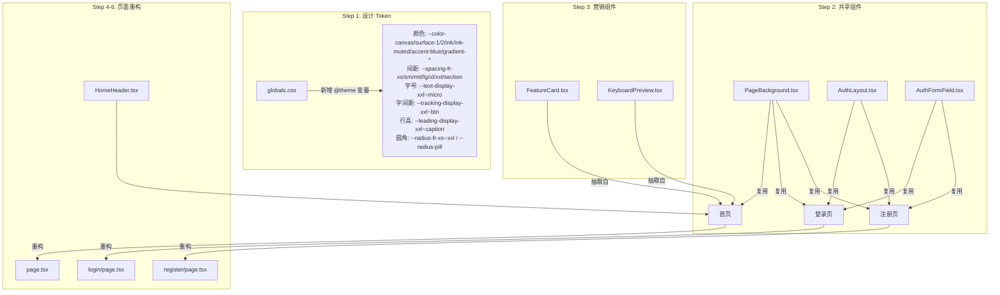

# 营销页面重构计划（基于 FRAMER_DESIGN.md）

## 当前问题诊断

- 颜色全部硬编码（`#0d0d0d`, `rgba(...)` 内联样式），无统一 token 层
- 背景装饰（渐变光晕 + 网格）在 `page.tsx` / `login/page.tsx` / `register/page.tsx` 中三次重复
- 表单字段（label + input + 错误提示）在登录、注册页各写一遍
- `FeatureCard` 和 `KeyboardPreview` 混在 `page.tsx` 末尾，未作组件化
- 按钮圆角不一致：设计规范要求 `pill`（100px），现在登录/注册用 `rounded-xl`（12px）
- Header 高度 `h-11`（44px），规范要求 56px
- `globals.css` 中的 `:root {}` 浅色 token 块从未被激活：`layout.tsx` 第 122 行将 `dark` 类**硬编码**在 `<html>` 上，项目永远处于暗色模式，`:root` 中的浅色值是冗余死代码
- Inter 本地字体仅加载了 400/700 两个静态字重，缺少可变字重轴（Variable），无法使用 OpenType 字符变体（`cv01/cv05/cv11` 等）

---

## 架构变更总览



---

## Step 1 — 设计 Token 层（全量）

**文件：** [`packages/ui/src/styles/globals.css`](packages/ui/src/styles/globals.css)

在 `@theme inline` 块中追加 **FRAMER_DESIGN.md 中全部四类 token**，Tailwind v4 会自动将 `--color-*` / `--spacing-*` / `--text-*` / `--tracking-*` / `--leading-*` / `--radius-*` 映射为对应工具类：

### globals.css 整体结构调整

当前文件有两个 token 块：`:root {}` 浅色 + `.dark {}` 暗色。由于项目永远是暗色，直接**删除 `:root {}` 块**，将所有值合并进一个 `:root {}` 即可（不再需要 `.dark {}` 的覆盖层）。保留 `@custom-variant dark (&:is(.dark *))` 以维持组件中 `dark:` 工具类正常工作。

```
globals.css 新结构：
@import ...
@custom-variant dark ...        ← 保留（用于 dark: 工具类）
@theme inline { ... }           ← 扩展全量 token
:root { ... }                   ← 唯一 token 块（原 .dark 内容 + 暗色为唯一真值）
/* 滚动条、number input 等保持不变 */
```

### 1-A 颜色 token → `bg-canvas`, `text-ink`, `border-hairline`…

```css
/* --- Framer: Colors --- */
--color-canvas: #090909;
--color-surface-1: #141414;
--color-surface-2: #1c1c1c;
--color-ink: #ffffff;
--color-ink-muted: #999999;
--color-hairline: #262626;
--color-hairline-soft: #1a1a1a;
--color-accent-blue: #0099ff;
--color-inverse-canvas: #ffffff;
--color-inverse-ink: #000000;
--color-gradient-magenta: #d44df0;
--color-gradient-violet: #6a4cf5;
--color-gradient-orange: #ff7a3d;
--color-gradient-coral: #ff5577;
--color-semantic-success: #22c55e;
```

### 1-B 间距 token → `p-fr-section`, `gap-fr-lg`, `px-fr-md`…

Framer 使用 5px 为基础单位（4/8/12/15/20/30/40/96），与 Tailwind 默认 4px scale 不同，使用 `fr-` 前缀避免冲突：

```css
/* --- Framer: Spacing (5px base) --- */
--spacing-fr-hair: 1px;
--spacing-fr-xxs: 4px;
--spacing-fr-xs: 8px;
--spacing-fr-sm: 12px;
--spacing-fr-md: 15px;
--spacing-fr-lg: 20px;
--spacing-fr-xl: 30px;
--spacing-fr-xxl: 40px;
--spacing-fr-section: 96px;
```

生成的工具类示例：`p-fr-md`（15px）、`py-fr-section`（96px）、`gap-fr-xl`（30px）。

### 1-C 排版 token — 字号、行高、字间距

```css
/* --- Framer: Font Sizes → text-display-xxl ... text-micro --- */
--text-display-xxl: 110px;
--text-display-xl: 85px;
--text-display-lg: 62px;
--text-display-md: 32px;
--text-headline: 22px;
--text-subhead: 24px;
--text-body-lg: 18px;
--text-body-fr: 15px;
--text-body-sm: 14px;
--text-caption: 13px;
--text-micro: 12px;
--text-btn: 14px;

/* --- Framer: Letter Spacing → tracking-display-xxl ... --- */
--tracking-display-xxl: -5.5px;
--tracking-display-xl: -4.25px;
--tracking-display-lg: -3.1px;
--tracking-display-md: -1.0px;
--tracking-headline: -0.8px;
--tracking-subhead: -0.01px;
--tracking-body-fr: -0.15px;
--tracking-body-sm: -0.14px;
--tracking-caption: -0.13px;
--tracking-micro: -0.12px;
--tracking-btn: -0.14px;

/* --- Framer: Line Heights → leading-display-xxl ... --- */
--leading-display-xxl: 0.85;
--leading-display-xl: 0.95;
--leading-display-lg: 1.00;
--leading-display-md: 1.13;
--leading-headline: 1.20;
--leading-body-fr: 1.30;
--leading-body-sm: 1.40;
--leading-caption: 1.20;
```

使用示例：`text-display-xl tracking-display-xl leading-display-xl`（85px / -4.25px / 0.95）。

### 1-D 圆角 token → `rounded-pill`, `rounded-xxl`, `rounded-fr-md`…

```css
/* --- Framer: Border Radius --- */
--radius-fr-xs: 4px;
--radius-fr-sm: 6px;
--radius-fr-md: 10px;
--radius-fr-lg: 15px;
--radius-fr-xl: 20px;
--radius-fr-xxl: 30px;
--radius-pill: 100px;
```

注：使用 `fr-` 前缀（xs/sm/md/lg/xl/xxl）避免与 shadcn 现有 `--radius-sm/md/lg/xl` 冲突，`pill` 无冲突可直接命名。

---

**文件：** [`apps/web/app/layout.tsx`](apps/web/app/layout.tsx)

Inter Variable 已以**本地字体**加载（`public/fonts/inter/`），但仅含静态 400/700 切割版，缺少可变字重轴。需要替换为 `Inter` via `next/font/google` 的 variable 版（`variable: "--font-inter-variable"`），使 OpenType 变体（`cv01`、`cv05`、`cv11`、`ss03`、`ss07` 等）可用。

在 `globals.css` 的 `@theme inline` 中注册：
```css
--font-inter-var: var(--font-inter-variable);
```
并在 `@layer base` 中为营销页面 body 追加字体特性：
```css
body {
  font-feature-settings: "cv01", "cv05", "cv09", "cv11", "ss03", "ss07";
}
```
GT Walsheim 不可用时，以 `inter-variable` 加极负 tracking（`tracking-display-xl` / `tracking-display-xxl`）近似替代 display 字体。

---

## Step 2 — 共享组件提取

### 2a. `PageBackground`
**新建：** `apps/web/components/marketing/PageBackground.tsx`

封装三个页面共有的背景装饰：渐变光晕（可通过 `variant` prop 切换 violet/emerald/orange）+ 细网格。消除当前三处重复代码。

```tsx
// 用法
<PageBackground variant="violet" />  // 首页
<PageBackground variant="violet" />  // 登录
<PageBackground variant="emerald" /> // 注册
```

### 2b. `AuthLayout`
**新建：** `apps/web/components/auth/AuthLayout.tsx`

封装登录/注册页的完整骨架：全屏居中容器 + PageBackground + 左上角返回首页链接 + 子内容插槽。

```tsx
// 用法（在登录/注册 page.tsx 中）
<AuthLayout backHref="/">
  {/* 卡片内容 */}
</AuthLayout>
```

### 2c. `AuthFormField`
**新建：** `apps/web/components/auth/AuthFormField.tsx`

封装 `label + input + 错误提示` 三件套，接受 `label`、`error`、所有原生 input 属性，统一输入框样式（`bg-surface-1`、`rounded-md-fr`、focus 时 `ring-accent-blue`）。

---

## Step 3 — 营销组件提取

**新建：** `apps/web/components/marketing/FeatureCard.tsx`
- 从 `page.tsx` 末尾的 `FeatureCard` + `colorMap` 剪切出来
- 用 `--color-gradient-*` token 替代硬编码 rgba 颜色映射
- 按规范改为 `rounded-xl`（20px）卡片

**新建：** `apps/web/components/marketing/KeyboardPreview.tsx`
- 从 `page.tsx` 末尾的 `KeyboardPreview` + `getAuroraColor` 剪切出来
- 保持渐变色逻辑不变，文件独立

---

## Step 4 — 重构 `HomeHeader`

**文件：** [`apps/web/components/layouts/HomeHeader.tsx`](apps/web/components/layouts/HomeHeader.tsx)

按规范调整：
- 高度从 `h-11`（44px）改为 `h-14`（56px），对齐 `top-nav` spec
- Logo 容器对齐规范（`rounded-md` icon + 字体 `body-sm`）
- 右侧 CTA 统一为 pill 按钮（`rounded-pill`，已接近正确，微调 padding 为 `10px 15px`）
- 添加移动端折叠逻辑注释占位（当前无汉堡菜单，本次先对齐样式）

---

## Step 5 — 重构首页 `page.tsx`

**文件：** [`apps/web/app/page.tsx`](apps/web/app/page.tsx)

变更：
- 背景 `#0d0d0d` → `bg-canvas`，引入 `<PageBackground />`
- Hero 标题追加负 tracking：`tracking-[-0.05em]`（对应 display-xl spec）
- 主 CTA 从 `rounded-xl` 改为 `rounded-full`（pill），颜色改用 token
- 次要 CTA 从 `border border-white/10 bg-white/[0.04]` 改用 `bg-surface-1 rounded-full`（button-secondary）
- 删除内联 `FeatureCard` / `KeyboardPreview` 定义，改为 import
- Features 网格卡片背景从 `bg-white/[0.025]` 改用 `bg-surface-1`

---

## Step 6 — 重构登录/注册页

**文件：** [`apps/web/app/login/page.tsx`](apps/web/app/login/page.tsx)
**文件：** [`apps/web/app/register/page.tsx`](apps/web/app/register/page.tsx)

变更（两个页面相同）：
- 整个背景 + 返回链接 → 替换为 `<AuthLayout>`
- 两个 `<input>` 块 → 替换为 `<AuthFormField>`
- 卡片背景从 `bg-white/[0.03]` 改用 `bg-surface-1`；边框从 `border-white/8` 改用 `border-hairline`
- 提交按钮从 `rounded-xl` 改为 `rounded-full`（pill），padding `10px 15px`（button-primary spec）
- Focus ring 改用 `ring-accent-blue/15`（level-3 shadow spec）

---

## 文件清单

| 操作 | 文件 |
|------|------|
| 修改 | `packages/ui/src/styles/globals.css` |
| 修改 | `apps/web/app/layout.tsx` |
| 修改 | `apps/web/components/layouts/HomeHeader.tsx` |
| 修改 | `apps/web/app/page.tsx` |
| 修改 | `apps/web/app/login/page.tsx` |
| 修改 | `apps/web/app/register/page.tsx` |
| 新建 | `apps/web/components/marketing/PageBackground.tsx` |
| 新建 | `apps/web/components/marketing/FeatureCard.tsx` |
| 新建 | `apps/web/components/marketing/KeyboardPreview.tsx` |
| 新建 | `apps/web/components/auth/AuthLayout.tsx` |
| 新建 | `apps/web/components/auth/AuthFormField.tsx` |

**不涉及：** `app/design/`、`app/admin/`、`app/profile/`、`app/checkout/`
