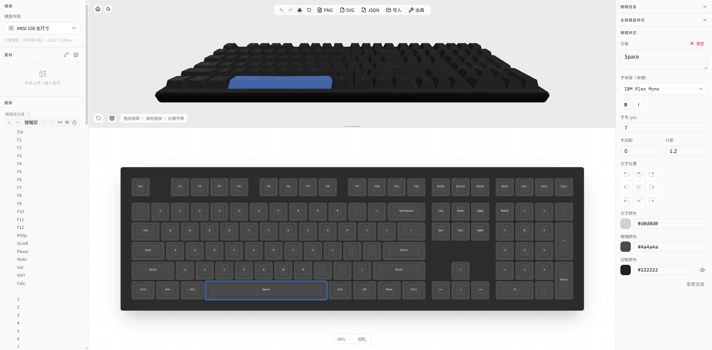

# Keyboard Designer

<p align="center">
  <picture>
    <source media="(prefers-color-scheme: dark)" srcset="apps/web/public/images/hero_dark.png">
    <source media="(prefers-color-scheme: light)" srcset="apps/web/public/images/hero_light.png">
    
  </picture>
</p>

Keyboard Designer 是一个浏览器端键帽设计器，可在页面中编辑布局、样式与贴图，并导出 PNG、SVG、JSON 与治具文件。

## 能力

- 无注册、登录、用户中心和管理后台。
- 无服务端存储、自动保存或跨设备同步。
- 设计状态只存在于当前浏览器页面内；**刷新、关闭标签页或浏览器崩溃都会丢失未导出的修改**。
- 保存和恢复依靠手动导出、导入 JSON 文件。
- 支持在浏览器内导出 PNG、SVG、JSON 和 JIG 治具 SVG，文字转曲不依赖 API。
- 可在当前会话临时加载 TTF/OTF 字体；字体只保存在内存中，刷新后移除。
- 不需要 API、PostgreSQL、Redis、Prisma、JWT、邮件、对象存储或支付配置。

处理重要设计时，建议在关键步骤反复导出 JSON，并将文件纳入自己的备份流程。

仓库里曾有一套 NestJS 全栈后端（鉴权、云端设计、订单支付、管理后台等），现已废弃并整包保留在 [`legacy/`](legacy/README.md)。默认构建不会使用它。若有需要，请按该文档自行恢复，而不是寻找产品模式开关。

## 本地运行

环境要求：

- Node.js >= 22
- pnpm 11.12.0（建议先运行 `corepack enable`）

```bash
pnpm install
pnpm dev
```

访问：

- `http://localhost:3000`：产品首页
- `http://localhost:3000/design`：设计器

无需启动任何后端进程。Web 也不依赖环境变量。

## 常用命令

```bash
pnpm dev        # 启动开发服务器
pnpm build      # 构建生产包
pnpm start      # 启动生产构建
pnpm lint       # 代码检查
pnpm test       # 运行单元测试
pnpm typecheck  # 类型检查
```

## 部署到 Vercel

`apps/web/vercel.json` 使用 Vercel 的 Next.js 框架预设。

1. 在 Vercel 导入仓库。
2. 将项目 Root Directory 设为 `apps/web`。
3. 打开 **Include source files outside of the Root Directory**，让构建能够读取 workspace 中的 `packages/ui`。
4. Install、Build 和 Output Directory 保持框架默认值。
5. 将 `apps/web/lib/site.ts` 中的 `url` 改成你的生产站点地址（用于 metadata / Open Graph）。
6. 不需要配置后端或 `NEXT_PUBLIC_*` 密钥，然后部署。

也可以使用 Vercel CLI：

```bash
cd apps/web
vercel
vercel --prod
```

详细步骤和故障排查见 [部署指南](docs/DEPLOYMENT.md)。

## 许可证

本项目采用 [MIT License](LICENSE)。

字体、GLB 模型、图片和图标等第三方资源可能有独立许可，再分发前请分别核对。

## 仓库结构

```text
keyboard-designer/
├── apps/
│   └── web/                # Next.js 前端，含 Vercel 配置
├── packages/
│   ├── ui/                 # 共享 UI 组件
│   ├── eslint-config/      # ESLint 配置
│   └── typescript-config/  # TypeScript 配置
├── docs/                   # 项目文档
└── legacy/                 # 已废弃的后端与全栈 Docker，见 legacy/README.md
```

更多开发细节见 [apps/web/README.md](apps/web/README.md)。
