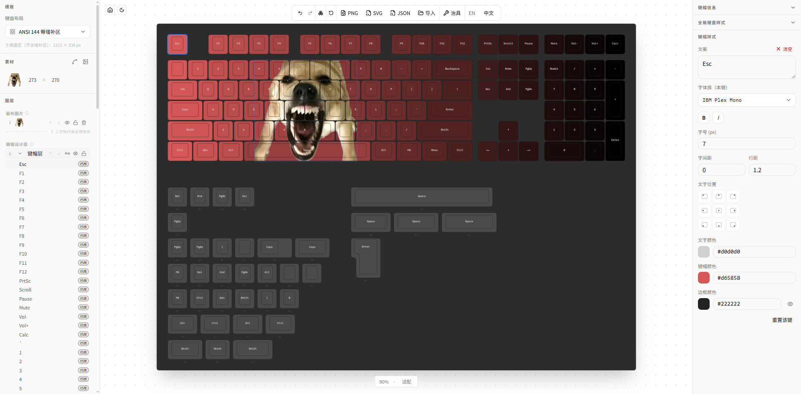

# Keyboard Designer

[English](README.md) | [简体中文](README.zh-CN.md)

<p align="center">
  <picture>
    <source media="(prefers-color-scheme: dark)" srcset="apps/web/public/images/hero_dark.png">
    <source media="(prefers-color-scheme: light)" srcset="apps/web/public/images/hero_light.png">
    
  </picture>
</p>

Keyboard Designer is a browser-based keycap editor. Open it, pick a layout, paint colors and legends, then export PNG, SVG, JSON, or production jig files — no sign-up, no backend, no cloud storage.

<p align="center">
  <picture>
    <source media="(prefers-color-scheme: dark)" srcset="apps/web/public/images/feature_dark.png">
    <source media="(prefers-color-scheme: light)" srcset="apps/web/public/images/feature_light.png">
    
  </picture>
</p>

## What it does

- **Live editor** — drag to pan, box-select keys, and preview every color, legend, and icon as you edit.
- **Layouts** — built-in ANSI 60% / 68% / 81% / TKL 87 / 104 / 108 / 144 layouts, driven by JSON.
- **Layers** — stack keycap color and style overrides, then manage them from the layer panel.
- **Keycap styling** — legends, fonts, weight, solid colors, gradients, borders, padding, and alignment.
- **Batch edit** — change many keys at once after a box or multi-select.
- **Canvas artwork** — drop images onto the board, transform them, and layer them with the keys.
- **Undo / redo** — full history in the current session (`Ctrl/⌘ + Z / Y`).
- **Exports** — PNG, SVG (text outlined in the browser with opentype.js), JSON, and jig SVG. No API call.
- **Session fonts** — load TTF/OTF for the current tab; they live in memory and disappear on refresh.
- **English / 简体中文** — UI locale with `en` as the default.

There is no account, user center, or admin console. Design state exists only in the current browser tab. **Refresh, close the tab, or crash the browser and unsaved work is gone.** Save by exporting JSON and keep those files in your own backup flow.

The product does not need API, PostgreSQL, Redis, Prisma, JWT, email, object storage, or payment configuration.

## Tech stack

| Area | Choice |
|------|--------|
| App | [Next.js 16](https://nextjs.org/) (App Router + Turbopack) |
| UI | [React 19](https://react.dev/), [Tailwind CSS 4](https://tailwindcss.com/), [shadcn/ui](https://ui.shadcn.com/) |
| i18n | [next-intl](https://next-intl.dev/) (`en` default, `zh` prefixed) |
| State | [Zustand](https://zustand-demo.pmnd.rs/) + [zundo](https://github.com/charkour/zundo) |
| Gestures | [@use-gesture/react](https://use-gesture.netlify.app/), [@react-spring/web](https://www.react-spring.dev/) |
| Export | Browser [opentype.js](https://opentype.js.org/) in `apps/web/lib/export/browser/` |
| Monorepo | pnpm workspaces + [Turborepo](https://turbo.build/) |

## Repository layout

```text
keyboard-designer/
├── apps/
│   └── web/                 # Next.js product (home + /design editor)
├── packages/
│   ├── ui/                  # Shared shadcn/ui components and styles
│   ├── eslint-config/       # Shared ESLint config
│   └── typescript-config/   # Shared TypeScript config
└── legacy/                  # Retired NestJS API and Docker stack
```

A former NestJS backend (auth, cloud designs, orders, payments, admin) is kept under [`legacy/`](legacy/README.md). The default install, dev server, and production build never load it. Restore it only if you need that stack — there is no product-mode flag.

Web-app details live in [`apps/web/README.md`](apps/web/README.md).

## Run locally

Requirements:

- Node.js >= 22
- pnpm 11.12.0 (`corepack enable` is the usual way to pin it)

```bash
pnpm install
pnpm dev
```

Then open:

- `http://localhost:3000` — marketing home (English)
- `http://localhost:3000/zh` — marketing home (简体中文)
- `http://localhost:3000/design` — editor
- `http://localhost:3000/zh/design` — editor in 简体中文

No backend process and no environment variables are required. The editor is desktop-first (≥ 768px).

## Scripts

From the repo root:

```bash
pnpm dev        # Next.js dev server
pnpm build      # production build
pnpm start      # serve the production build
pnpm lint       # lint
pnpm test       # unit tests
pnpm typecheck  # TypeScript
```

## License

[MIT License](LICENSE).

Third-party fonts, GLB models, images, and icons may use their own licenses — check those before redistributing.
