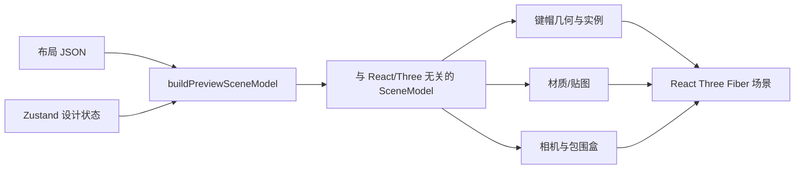

# 设计器旁路 3D 预览实施路线图

> 目标：在不改变现有 2D 设计器作为唯一编辑源的前提下，提供一个与设计状态实时同步、视觉可信、可稳定维护的只读 3D 旁路预览。

## 1. 结论先行

当前实现的“外壳”方向基本正确，可以保留并继续演进：

- `DesignCanvas.tsx` 使用 `dynamic(..., { ssr: false })` 延迟加载 WebGL 代码，避免 Next.js 服务端渲染 Three.js。
- `show3dPreview` 是纯 UI 状态，并已从 zundo 撤销快照中排除。
- 关闭预览时卸载 `<Canvas>`，可以释放渲染循环和 WebGL 资源。
- 预览区与 2D 画布采用纵向 flex 分栏，并支持拖动调整高度。
- 当前坐标约定清晰：2D 的 `x/y` 映射为 3D 的 `x/z`，Three.js 使用 Y-up。

因此不需要推倒重写。下一步的重点不是继续堆场景组件，而是先补一层稳定的领域适配：



推荐把最终目标拆成三个层次：

1. **壳层**：面板开关、尺寸、加载、错误状态、WebGL 生命周期。
2. **领域适配层**：把布局、图层、单键覆盖、选择态和素材解析为稳定的 3D 场景数据。
3. **渲染层**：只消费场景数据，负责模型、材质、灯光、相机、交互和性能。

## 2. 当前项目事实

### 2.1 已有入口与状态

- 预览入口：`apps/web/modules/design/components/canvas/DesignCanvas.tsx`
- 工具栏开关：`apps/web/modules/design/components/canvas/CanvasToolbar.tsx`
- UI 状态：`apps/web/modules/design/store/designUiStore.ts`
- 3D Canvas：`apps/web/modules/design/components/preview3d/Keycap3DPreview.tsx`
- 场景：`apps/web/modules/design/components/preview3d/Keyboard3DScene.tsx`
- 占位键帽：`apps/web/modules/design/components/preview3d/PlaceholderKeycap.tsx`
- 坐标转换：`apps/web/modules/design/lib/preview3d/layoutToWorld.ts`
- 现有模型：`apps/web/public/models/keycap_1U.glb`

项目已安装：

- `three`
- `@react-three/fiber`
- `@react-three/drei`

### 2.2 当前数据来源

键盘布局来自：

- `apps/web/modules/design/data/layouts/index.ts`
- `apps/web/modules/design/data/layouts/*.json`

布局单位为 `1u`，当前所有模板的 `baseUnit` 为 54 个 SVG 单位。布局包含：

- `x/y/w/h`
- `keyId`
- 默认 `label`
- `shape`
- `rowLevel`
- `section`

现有模板除普通矩形键外，还存在：

- `ansi-144` 中的 ISO Enter：`shape: "iso"`
- `ansi-144` 中的阶梯 Caps：`shape: "stepped"`

设计外观状态来自 `designUiStore.ts`：

- `globalKeycapStyle`
- `layers`
- `layerKeycapOverrides`
- `canvasElements`
- `assetMap`
- `selectedKeycapIds`
- `activeLayerId`
- 字体、字重、字形

当前 3D 场景已订阅模板、颜色、图层、覆盖样式与选择态，但渲染仍为占位长方体，尚未加载 GLB。

### 2.3 当前实现中应保留的部分

- `keyDefToWorld()` 中 `1u = 1.0` 的世界单位约定。
- 以键帽中心而不是左上角放置 mesh。
- 通过键盘包围盒与 FOV/宽高比拟合相机。
- 动态导入和关闭即卸载的生命周期。
- `frameloop="demand"`、DPR 上限、错误边界与复位视角。
- OrbitControls 的阻尼和禁止翻到键盘底部。

### 2.4 当前实现中仍需推进的部分

1. GLB 尚未被代码使用，也没有约定模型的单位、原点、朝向、mesh 名称和材质槽。
2. 直接把 1U GLB 非等比拉伸成 2U/6.25U 会拉宽边缘和圆角，不适合作为最终方案。
3. ISO、stepped、竖向 2U 和不同键帽行高目前都被当作普通长方体。
4. 模型加载失败时缺少非阻塞降级提示（当前错误边界会整页失败）。
5. 没有共享的“最终键帽外观解析器”；2D 与 3D 如果各自解析 store，后续一定会出现显示不一致。

## 3. 产品边界

第一版应明确为**只读旁路预览**：

- 2D 设计器仍是唯一编辑源。
- 3D 实时反映模板、键帽颜色、标签、图层可见性和选择态。
- 3D 中允许旋转、缩放、复位视角。
- 3D 点击键帽可以同步 2D 选择，但不直接修改样式。
- 关闭预览后不保留 GPU 渲染。

第一版暂不做：

- 真实轴体、定位板、PCB、外壳结构。
- 物理级 PBR 材质编辑器。
- 每种键帽高度/profile 的制造级精度。
- 在 3D 中拖动文字或图片。
- 3D 文件导出。
- 依赖 3D 反向修改设计文档的双向数据模型。

这些边界能避免把“设计结果预览”过早扩展为第二套编辑器。

## 4. 目标目录结构

建议逐步收敛为：

```text
apps/web/modules/design/
├─ types/
│  └─ design.ts                         # KeyDef 等领域类型
├─ lib/
│  ├─ design/
│  │  ├─ layout.ts                      # flattenLayout、bounds
│  │  └─ resolveKeycapAppearance.ts     # 2D/3D 共用外观解析
│  └─ preview3d/
│     ├─ constants.ts
│     ├─ types.ts                       # PreviewSceneModel
│     ├─ layoutToWorld.ts               # 纯坐标与包围盒函数
│     ├─ buildPreviewSceneModel.ts       # store 快照 -> SceneModel
│     ├─ cameraFit.ts                    # 按 FOV/宽高比计算 fit
│     ├─ modelContract.ts                # GLB 节点/单位/轴约定
│     └─ texture/
│        ├─ buildDesignAtlas.ts
│        └─ disposeTexture.ts
└─ components/
   └─ preview3d/
      ├─ Keycap3DPreview.tsx             # 壳层
      ├─ Preview3DErrorBoundary.tsx
      ├─ Keyboard3DScene.tsx             # 场景编排
      ├─ CameraController.tsx
      ├─ KeyboardKeycaps.tsx
      ├─ KeycapMesh.tsx
      ├─ KeyboardBase.tsx
      └─ Preview3DOverlay.tsx            # loading/error/reset
```

不要一次性创建所有文件。下面每个阶段只创建当期真正使用的模块。

## 5. 核心数据模型

先定义与 React、Zustand、Three.js 都无关的场景模型。渲染层只接收这个模型：

```ts
export interface PreviewKey {
  id: string
  label: string
  shape: "rect" | "iso" | "stepped"
  section: "base" | "supplement"
  rowLevel?: string
  position: [number, number, number]
  sizeU: [number, number]
  color: string
  labelColor: string
  selected: boolean
  visible: boolean
}

export interface PreviewSceneModel {
  templateId: string
  keys: PreviewKey[]
  bounds: {
    min: [number, number, number]
    max: [number, number, number]
    center: [number, number, number]
  }
  revision: string
}
```

`revision` 用于判断几何、材质或贴图是否真的需要更新。不要让整个 Zustand store 直接进入 Three.js 组件。

### 5.1 Store 订阅原则

建立专用 selector，例如 `usePreview3DModel()`，只订阅 3D 所需字段：

- `templateId`
- `globalKeycapStyle`
- `layers`
- `layerKeycapOverrides`
- `canvasElements`
- `assetMap`
- `selectedKeycapIds`
- 字体相关字段

使用浅比较，并把以下数据分开：

- **几何 revision**：模板、布局、shape 变化。
- **外观 revision**：颜色、文字、图层、图片变化。
- **交互 revision**：选择态变化。

这样改一个键的颜色时不会重建全部 geometry。

## 6. 分阶段实施

## Phase 0：固定现有壳与验收基线

目标：让当前占位方块版本成为可靠基线，再替换模型。

实施步骤：

1. 保留现有动态导入、开关和纵向分栏。
2. 把预览高度常量从 `DesignCanvas.tsx` 移入 preview3d 配置。
3. 给拖动分隔条补键盘操作：
   - `ArrowUp/ArrowDown` 调整高度。
   - `Home/End` 切到最小/最大高度。
4. 把预览高度保存在纯 UI store 或 localStorage；不要进入设计 JSON 和撤销历史。
5. `<Canvas>` 改为 `frameloop="demand"`。
6. 开启或明确关闭 shadows；不要保留“写了 castShadow 但无效果”的半配置。
7. 增加加载 overlay 和错误边界。
8. 增加“复位视角”按钮，并给出鼠标操作提示。
9. 模板变化时自动 fit；普通样式变化时不要重置用户视角。

完成标准：

- 打开/关闭 20 次不出现重复 Canvas、事件监听或明显内存增长。
- 静止时不持续占用显著 GPU。
- 七种模板均能完整显示，不裁边。
- 改预览高度后 Canvas 尺寸和相机 fit 正确更新。

## Phase 1：抽离领域类型与纯场景适配器

目标：解除 3D 对 2D 组件的依赖，并建立可单测的数据入口。

实施步骤：

1. 将 `KeyDef` 从 `components/canvas/KeycapNode.tsx` 移到 `modules/design/types/design.ts`。
2. 提取 `flattenLayout(layout)`，由 2D 和 3D 共用。
3. 合并 `getKeyboardCenter()`、`getKeyboardExtents()` 为一次遍历得到完整 bounds。
4. 实现 `buildPreviewSceneModel(layout, designState)`，保持纯函数。
5. 将 `keyDefToWorld()` 改为接收领域类型，不再 import React 组件。
6. 给所有空布局、负尺寸和未知 shape 提供显式 fallback。
7. 明确坐标契约：
   - 设计坐标：X 向右、Y 向下。
   - Three 坐标：X 向右、Y 向上、Z 朝使用者。
   - 键帽原点：底面中心或几何中心，二选一后全项目统一。
   - `1u = 1 world unit`。

建议先为以下纯函数加测试：

- 普通 1U、2U、竖向 2U 的位置和尺寸。
- 非零起点布局的 bounds。
- 空布局。
- gap 从 SVG 单位转换到 u。
- ISO/stepped shape 不被错误丢失。
- section 和 rowLevel 被保留。

完成标准：

- `Keyboard3DScene` 不再直接读取 layout JSON，也不再自己拼 store 状态。
- 2D 与 3D 使用同一份 layout flatten 结果。
- 所有坐标转换都能在不挂载 React 的情况下测试。

## Phase 2：定义模型资产契约并替换占位方块

目标：让 `keycap_1U.glb` 成为可验证资产，而不是“加载后凭感觉 scale”。

### 2.1 先检查并固定 GLB 契约

在 Blender 或资产检查脚本中确认：

- 文件单位与 `1u` 的换算。
- 模型长、宽、高。
- 原点是否位于底面中心。
- 正面方向、顶部方向。
- mesh/node 名称。
- 是否区分底座和顶面材质槽。
- 法线、切线和 UV 是否有效。
- 是否应用 transform。

将约定写入 `modelContract.ts`，开发环境加载后校验节点名；不符合时显示可理解错误。

推荐约定：

- +Y 为上。
- +Z 为键盘下方/使用者方向。
- 原点位于键帽底面中心。
- 1U 外轮廓占 `1 - gapU`。
- 本体单色材质即可；若资产含顶面/侧面材质槽，运行时统一涂同一 `color`（顶面 atlas 阶段再单独贴纹理）。

### 2.2 不要直接非等比拉伸 1U

高质量方案按推荐顺序为：

1. **参数化键帽几何**：边框、圆角和斜面尺寸固定，只延长中间区域。
2. **预生成尺寸族 GLB**：1U、1.25U、1.5U、1.75U、2U、2.25U、2.75U、6.25U、竖向 2U、ISO、stepped。
3. 普通非等比 scale 只作为临时 fallback，并在开发环境标记。

本项目已有多种宽度、竖向键和特殊 shape，最终至少需要：

- 横向普通键尺寸族。
- 竖向 2U。
- ISO Enter。
- stepped Caps。

### 2.3 模型加载实现

1. 使用 `useGLTF("/models/keycap_1U.glb")`。
2. 在模块底部调用 `useGLTF.preload()`。
3. 共享原始 geometry，不要为每个键重新解析 GLB。
4. 若每个键需要不同材质，克隆 material 或使用实例颜色，不能直接修改 GLTF 共享材质。
5. 组件卸载时只 dispose 自己创建的材质/纹理，不要误 dispose drei 缓存的共享 geometry。
6. 模型加载失败时回退到程序化占位键帽，并显示非阻塞提示。

完成标准：

- 144 键模板只下载并解析一次 GLB。
- 切模板不会重复创建不可回收的材质。
- 不同尺寸键的边缘厚度和圆角没有明显拉伸。
- 特殊键形有明确实现或明确 fallback，不静默伪装成正确模型。

## Phase 3：同步颜色、图层和选择态

目标：用户改动 2D 设计时，3D 外观即时且可预测地更新。

### 3.1 先建立共享外观解析器

实现：`apps/web/modules/design/lib/design/resolveKeycapAppearance.ts`。

- `resolveLayerKeycapFields()`：单层字段优先级（2D `KeycapNode` 与 3D 共用）。
- `resolveSolidColor()`：渐变 → 50% 插值纯色（仅 3D 路径）。
- `resolveKeycapAppearance()`：可见图层自底向顶纯色 alpha 合成（3D）。

#### 已文档化的图层语义

| 规则 | 约定 |
|------|------|
| 图层顺序 | `layers[]` 中 index 0 为视觉最顶；合成时从数组末尾扫到开头（底→顶） |
| 单层字段 | `override.field ?? global.field ?? default` |
| opacity | 整层 alpha（等价 2D `<g opacity>`），不是「只作用于有 override 的属性」 |
| visible=false | 该层不参与合成；无任何可见层 → 整键不画 |
| labelsHidden | 图层级；合成取最顶可见层的值（Phase 4 用；Phase 3 的 3D 仍不渲染字） |
| 渐变 | 3D 降级为 50% 插值纯色；2D 仍画真实 SVG 渐变 |
| 图片 | Phase 3 忽略 |
| border | 解析可算；**3D mesh 不消费** |

2D 继续「每个可见图层各画一整颗键帽」；3D 用合成后的单一纯色。不把 2D 改成「合成后只画一次」。

### 3.2 材质策略

第一步只支持纯色：

- `color` -> 整颗键帽本体材质（侧面与顶面同色）。
- 选中态 -> emissive，不替换设计颜色（GLB 与 Placeholder 一致）。

Phase 3 **不做** InstancedMesh 大重构；稳定 `key={id}` + 共享 GLTF geometry 即可满足「改色不重载模型」。按几何分组实例化延后到 Phase 6。

### 3.3 更新粒度

- 单键 / 图层外观变化：重算 `PreviewSceneModel`，不重新加载 GLB。
- 模板变化：才重建键帽几何路径与 bounds。
- `appearanceRevision` 指纹须包含全局色、各层 visible/opacity/labelsHidden、以及 overrides。
- 选择变化不重置相机。

完成标准：

- 全局 `color`、单键 override 实时同步。
- 图层显示、隐藏、透明度合成方向与 2D 一致。
- 渐变在 3D 显示为稳定中点纯色。
- 选择态清晰但不污染设计颜色。
- undo/redo 后 3D 同步更新，且 3D 相机不被重置。
- border / 文字 / atlas / InstancedMesh 不在本阶段交付。

## Phase 4：实现标签、渐变与画布图片

目标：从“键帽颜色预览”升级为“设计成品预览”。

这一阶段最容易失控，建议分两步。

### 4.1 标签 MVP

可以先用 drei 的 `<Text>` 验证：

- `labelText`
- `labelColor`
- 字号
- 字重/字形
- 换行
- labelOffsetX/Y
- row profile 对标签倾角的影响

但 100～144 个独立 Text 对象会增加 draw call 和字体 atlas 管理复杂度，所以它不应是最终高保真实现。

### 4.2 最终推荐：设计纹理 atlas

建立独立的离屏设计表面渲染器，把每个键帽顶面最终结果烘焙进一张共享 atlas：

- 文字。
- 纯色和 CSS gradient。
- clipToKeycaps / clipToKeycapId 图片。
- 图片旋转、透明度和 top-face 裁剪。
- 图层可见性与 opacity。

实施原则：

1. 不要直接截图当前 DOM，因为当前 DOM 含选择框、交互层和 UI 状态。
2. 把“设计表面渲染”提取为纯 SVG/Canvas 输出，2D 导出和 3D atlas 共用。
3. atlas 使用稳定 UV；模板不变时只更新纹理，不更新 geometry。
4. 连续拖动时以 `requestAnimationFrame` 或 80～150ms debounce 合并重烘焙。
5. 限制 atlas 最大尺寸，按设备 DPR 分级。
6. 替换 CanvasTexture 时及时 dispose 旧纹理。
7. 纹理使用正确 color space，并按需要设置 anisotropy。

对于可区分顶面 UV 的模型：

- 顶面采样 atlas（标签 / 渐变 / 图片）。
- 侧面继续使用本体 `color`/PBR 材质。
- geometry 需要清晰的 material groups 或顶面 mask。

完成标准：

- 标签位置、颜色、换行与 2D 接近。
- gradient 不再降级为单色。
- 裁剪到键帽的图片能映射到相应键帽顶面。
- 拖动图片时预览可稍微延迟，但拖动结束后必须收敛到准确结果。
- atlas 更新不会导致纹理数量持续增长。

## Phase 5：相机、灯光与交互体验

目标：让它像设计工具的预览，而不是 Three.js 示例。

### 5.1 相机

实现 `fitPerspectiveCameraToBounds()`：

1. 读取 Canvas 的实际宽高比。
2. 根据垂直 FOV 推导水平 FOV。
3. 分别计算容纳 bounds 宽度和深度所需距离。
4. 取较大值并加 10%～15% padding。
5. 更新 near/far，避免大模板深度精度过差。

行为规则：

- 第一次打开：自动 fit。
- 切模板：自动 fit。
- 面板 resize：保持 target，并在必要时 fit 防止裁切。
- 颜色、文字、选择变化：不改变视角。
- 提供“俯视 / 透视 / 复位”三个视角预设即可，不必做复杂相机编辑器。

### 5.2 灯光与底板

推荐简单稳定的 studio setup：

- Hemisphere 或较低强度 ambient。
- 一盏主 DirectionalLight。
- 一盏较弱补光。
- 接收阴影的中性底板。
- 可选 Environment，但 HDR 必须本地托管并控制体积。

先追求不同颜色可辨识，再追求“高级感”。高强度彩色环境光会让用户误判设计颜色。

### 5.3 交互

- 左键旋转、滚轮缩放、右键或中键平移。
- 限制极角，避免穿过底板。
- 点击键帽同步 `selectedKeycapIds`。
- Shift+点击复用 2D 多选语义。
- 点击空白不必默认清空 2D 选择，避免误操作；是否清空应显式决定。
- hover 只做轻量高亮，不显示大 tooltip。
- 预览区域应阻止滚轮冒泡，避免同时滚动页面。

完成标准：

- 常用操作无需说明也可发现。
- 复位视角在所有模板上结果一致。
- 3D 点击选择与 2D、右侧属性面板同步。
- 3D 交互不会触发 2D 框选或拖放事件。

## Phase 6：性能、稳定性与降级

目标：让 3D 是可选增强，不影响设计器主流程。

### 6.1 渲染预算

建议以 144 键模板为基准：

- 静止：`frameloop="demand"`，无持续动画。
- 交互：常见中端集显保持约 50 FPS 以上。
- 模型：共享 geometry 和纹理。
- atlas：通常不超过 2048×2048；只有高性能设备才提高。
- DPR：默认 `[1, 1.5]`，不盲目跟随 3x 屏幕。
- 阴影：低分辨率、有限范围，低性能模式可关闭。

在功能正确后，再将相同几何/材质键帽迁移到 `InstancedMesh`。不要在场景模型尚未稳定前过早实例化。

### 6.2 生命周期

逐项验证：

- 打开/关闭预览。
- 连续切换模板。
- 连续 undo/redo。
- 导入设计 JSON。
- 重置设计。
- 浏览器标签页隐藏/恢复。
- WebGL context lost/restored。

需要清理：

- 自建 geometry。
- 克隆 material。
- CanvasTexture。
- ResizeObserver。
- window/document 事件。
- debounce/RAF。

### 6.3 降级

- WebGL 不可用：显示“此设备无法使用 3D 预览”，2D 编辑器继续工作。
- GLB 加载失败：显示程序化键帽 fallback。
- atlas 生成失败：退回纯色材质。
- 低性能设备：关闭阴影、降低 DPR、降低 atlas 分辨率。
- 错误边界只能包住 3D 区域，不能让整个设计器白屏。

## Phase 7：测试与验收

当前 `apps/web/package.json` 只有 lint/typecheck/build，仓库中未发现 Vitest 或 Playwright 配置。建议按需要补：

### 7.1 单元测试

引入 Vitest，优先测试纯函数：

- `flattenLayout`
- `keyDefToWorld`
- bounds
- camera fit 数学
- `resolveKeycapAppearance`
- `buildPreviewSceneModel`
- atlas UV 映射

不要用快照测试整个 Three.js scene graph；这类快照脆弱且定位问题困难。

### 7.2 组件测试

验证：

- 预览开关不写入 undo history。
- 模板变化触发 scene model 重建。
- 样式变化不触发相机重置。
- 模型错误时显示 fallback。
- resize separator 的鼠标和键盘行为。

### 7.3 浏览器验收

后期引入 Playwright 或使用现有浏览器自动化完成：

- 七种模板逐一打开。
- ANSI-144 的 ISO/stepped 键。
- 全局颜色、单键颜色、文字编辑。
- 图层显示/隐藏/opacity。
- 图片裁剪到单键和多键。
- undo/redo、导入、重置。
- 打开/关闭 20 次。
- 768px 附近桌面布局和宽屏布局。

视觉回归截图应固定：

- 模板。
- 预览尺寸。
- 相机 preset。
- DPR。
- 灯光配置。

否则截图差异会被相机阻尼和设备像素比污染。

### 7.4 每个阶段执行的仓库命令

```bash
pnpm --filter web lint
pnpm --filter web typecheck
pnpm --filter web build
```

当前全量 typecheck 存在与 3D 无关的 admin 页面 `Type 'number' is not assignable to type 'never'` 等已有错误。实施时应同时记录：

- 本阶段改动文件的 IDE/ESLint 诊断必须为 0。
- 全量 typecheck 的既有错误列表不能增加。
- 待既有 admin 错误修复后，再把全量 typecheck 作为硬门禁。

## 7. 推荐 PR 拆分

为降低返工，建议按以下顺序提交：

### PR 1：预览壳加固

- `frameloop="demand"`
- loading/error/fallback
- 正确 resize 和相机 fit
- 复位视角
- 预览高度持久化

### PR 2：领域模型与测试

- 移动 `KeyDef`
- 提取 layout flatten/bounds
- `PreviewSceneModel`
- `buildPreviewSceneModel`
- 纯函数测试

### PR 3：真实键帽几何

- 固定 GLB contract
- 1U 模型加载与共享
- 尺寸族策略
- ISO/stepped fallback
- 资源释放检查

### PR 4：颜色、图层、选择同步

- [x] 共享 `resolveKeycapAppearance`
- [x] 纯色材质 + 渐变降级
- [x] 选择态 emissive（不污染设计色）
- [ ] 3D 点击同步选择（归 Phase 5）

### PR 5：标签与设计 atlas

- 共享离屏设计表面
- 文字、gradient、图片
- UV 与 CanvasTexture 生命周期

### PR 6：性能与视觉验收

- instancing
- 阴影和低性能模式
- 浏览器回归
- 性能预算与内存检查

每个 PR 都应保持 2D 编辑器可独立工作，不允许出现“必须打开 3D 才能编辑或保存”的依赖。

## 8. 第一轮实际编码清单

如果现在开始实现，第一轮只做以下内容，不要立刻做文字和图片：

- [ ] 移动 `KeyDef` 到领域类型文件并修正 import。
- [ ] 提取共享 `flattenLayout()` 和 bounds。
- [ ] 建立 `PreviewSceneModel` 与 `buildPreviewSceneModel()`。
- [ ] 把当前 Placeholder 场景改为消费 SceneModel。
- [ ] 把相机 fit 改为考虑 FOV 和面板宽高比。
- [ ] 改为 demand frameloop。
- [ ] 增加 loading、局部错误边界和模型 fallback。
- [ ] 检查 `keycap_1U.glb` 的原点、尺寸、朝向、节点名和材质槽。
- [ ] 用真实模型替换 1U 键，其他尺寸先保留明确标注的程序化 fallback。
- [ ] 补坐标、bounds、camera fit 的单元测试。

完成这一轮后，才进入“颜色和设计同步”。原因是如果场景数据边界、模型轴向或尺寸族尚未稳定，越早做材质和纹理，后续返工越大。

## 9. 最终验收定义

一个“好的旁路 3D 预览”至少应满足：

- **一致**：模板、颜色、文字、图层和图片与 2D 的最终设计规则一致。
- **稳定**：3D 出错不会影响 2D；打开关闭不会泄漏资源。
- **清楚**：相机不会裁切，灯光不会严重改变颜色判断。
- **流畅**：144 键模板旋转顺畅，静止时不持续浪费 GPU。
- **可维护**：Three.js 组件不直接理解整个 Zustand store，2D/3D 共用领域解析规则。
- **可降级**：模型、纹理或 WebGL 失败时仍能继续设计。

达到 Phase 3 后，可以称为“可用的 3D 预览”；达到 Phase 5 后，才接近“设计结果高保真预览”。

### Phase 3 交付状态（已完成）

- [x] 共享 `resolveKeycapAppearance` / `resolveLayerKeycapFields` / `resolveSolidColor`
- [x] 图层语义文档化（顺序、opacity、labelsHidden、渐变降级、border 3D 忽略）
- [x] 3D 多层纯色 alpha 合成；2D 仍多层 SVG 叠画
- [x] 渐变在 3D 降级为 50% 插值纯色
- [x] GLB / Placeholder 选中均用 emissive，不污染设计色
- [x] `appearanceRevision` 含全局色、图层、overrides
- [ ] 3D 文字 / atlas（Phase 4）
- [ ] InstancedMesh（Phase 6）
- [ ] 3D 点击同步选择（Phase 5）
